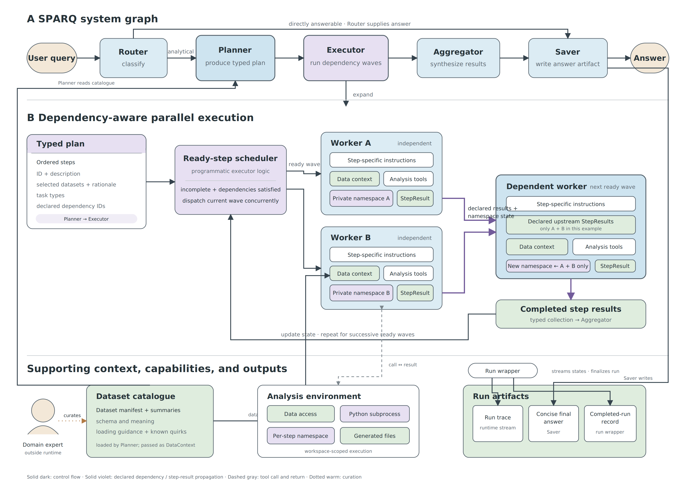

# SPARQ: dependency-aware agentic analysis

**Assets:** [editable SVG](sparq_agentic_system.svg) · [vector PDF](sparq_agentic_system.pdf) · [high-resolution PNG](sparq_agentic_system.png)

**Figure caption.** SPARQ routes a user query either through an analytical pipeline or directly to persistence. Analytical queries are transformed by the Planner into a typed sequence of steps carrying explicit dependency IDs and dataset metadata. The programmatic Executor repeatedly identifies all incomplete steps whose dependencies are complete, dispatches each ready wave concurrently, and collects typed `StepResult` objects. Each worker receives step-specific instructions, planner-produced data context, analysis tools, and a private Python namespace. Independent workers share no mutable namespace; a dependent worker receives only the results and namespace state of its declared predecessors. Terminal failures are retained as completed results after bounded retries, allowing later waves to proceed. The Aggregator—not the Executor—synthesizes step results into the user-facing answer. The Saver writes the concise answer artifact, while the run wrapper records streamed graph state and the completed-run record. A human-maintained dataset catalogue supplies manifest and summary context to the Planner and workers but is not an interactive approval point. Solid dark arrows denote control flow, violet arrows denote declared dependency or step-result propagation, dashed gray arrows denote tool calls and returns, and the dotted warm arrow denotes offline curation.

## Implementation details intentionally omitted from the drawing

- Individual tool function names, agent middleware, prompt templates, and configurable model/provider names.
- The three-attempt retry counter, namespace-size warning threshold, and deadlock exception text.
- REPL serialization, automatic package installation, subprocess timeout mechanics, and module restoration.
- Concrete artifact filenames (`trace.json`, `final_answer.json`, `result.json`, and `log.txt`) and timestamped output paths.
- Aggregator token counting and its filesystem read/list/search tool subset.
- Proposed but unimplemented features, including approval gates, replanning, evaluator agents, LangGraph `Send` fan-out, resumable progress, and shared worker memory.
